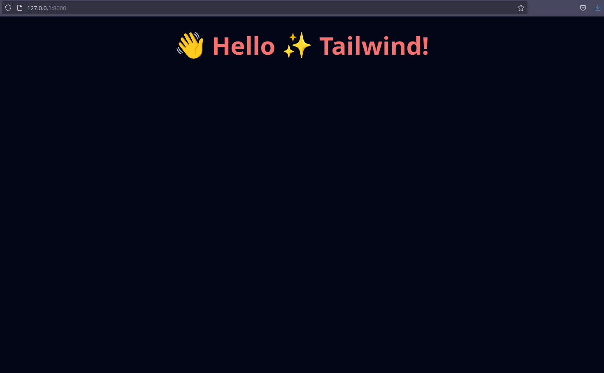

<div align="center">

  # ✨ 🔥 fastapi-tailwind

  <sub>Streamlined approach for adding TailwindCSS to FastAPI **without** NodeJS.</sub>

  

</div>

> [!WARNING]
> Currently in testing phase so expect bugs but do report them please. 🙏

## Features ✨
- [x] Auto watch when in dev mode. 🔎
- [x] Doesn't require NodeJS and NPM. 🫧🪥
- [x] Seemless integration into the FastAPI codebase. 🥂
- [ ] GZIP automatically configured to [compress TailwindCSS](https://v1.tailwindcss.com/docs/controlling-file-size). ⚡

## How to add?
> [!NOTE]
> These instructions assume you have a somewhat intermediate understanding of FastAPI and that you've used TailwindCSS before (if you haven't be sure to read the documentation I link in tailwind stages) as I may assume some things.

1. Install the pypi package.
```sh
pip install git+https://github.com/THEGOLDENPRO/fastapi-tailwind
```
> via ssh: `pip install git+ssh://git@github.com/THEGOLDENPRO/fastapi-tailwind.git`
2. Edit your FastAPI APP.

Before:
```python
from fastapi import FastAPI
from fastapi.responses import FileResponse
from fastapi.staticfiles import StaticFiles

app = FastAPI()

@app.get("/")
def index():
    return FileResponse("./index.html")

app.mount("/static", StaticFiles(directory = "static"), name = "static")
```

After:
```python
# main.py

from fastapi import FastAPI
from fastapi.responses import FileResponse
from fastapi.staticfiles import StaticFiles

from fastapi_tailwind import tailwind
from contextlib import asynccontextmanager

static_files = StaticFiles(directory = "static")

@asynccontextmanager
async def lifespan(app: FastAPI):
    # YAY, our tailwind get's compiled here! 😄
    process = tailwind.compile(static_files.directory + "/output.css")

    yield # The code after this is called on shutdown.

    process.terminate() # We must terminate the compiler on shutdown to
    # prevent multiple compilers running in development mode or when watch is enabled.

app = FastAPI(
    # See the fastapi documentation for an explanation on lifespans: https://fastapi.tiangolo.com/advanced/events/
    lifespan = lifespan
)

@app.get("/")
def index():
    return FileResponse("./index.html")

# We need somewhere to drop the compiled stylesheet so our html file can link it.
app.mount("/static", static_files, name = "static")
```

3. Make sure the `static` folder exists.
```sh
mkdir ./static
```
4. Generate `tailwind.config.js`, then [configure it](https://tailwindcss.com/docs/configuration) appropriately.
```sh
fastapi-tailwind-init
```
5. Write your tailwind css in `index.html`.
```html
<!DOCTYPE html>
<html lang="en">
<head>
    <meta charset="UTF-8">
    <meta name="viewport" content="width=device-width, initial-scale=1.0">
    <title>✨ Tailwind in 🔥 FastAPI</title>

    <link rel="stylesheet" href="/static/output.css">
</head>
<body class="bg-slate-950">
    <h1 class="mt-10 text-center text-6xl font-bold text-red-400">👋 Hello ✨ Tailwind!</h1>
</body>
</html>
```
6. Run FastAPI and visit your site.
```sh
fastapi dev main.py
```
<div align="center">

  

</div>
