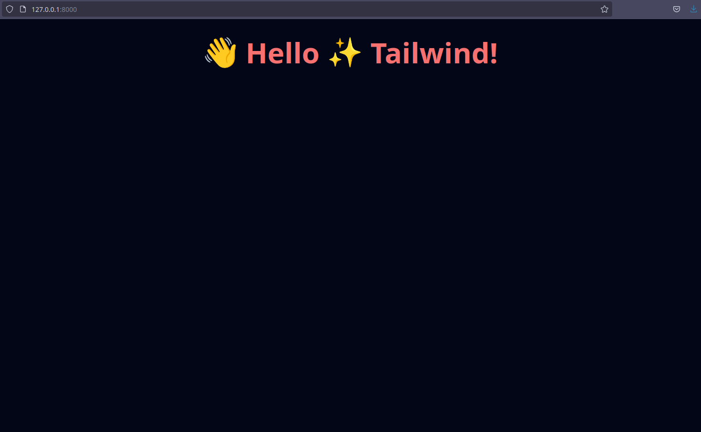

<div align="center">

  # ✨ 🔥 fastapi-tailwind

  <sub>Streamlined approach for adding TailwindCSS V4 to FastAPI **without** NodeJS.</sub>

  [](https://pypi.org/project/fastapi-tailwind/)
  [](https://pypistats.org/packages/fastapi-tailwind)
  [](https://pypi.org/project/fastapi-tailwind/)

  

</div>

> [!WARNING]
> Currently in alpha phase so expect bugs but do report them please. 🙏

## Features ✨
- [x] Zero dependencies 🪶
- [x] Auto watch when in dev mode. 🔎
- [x] Doesn't require NodeJS and NPM. 🫧🪥
- [x] Seemless integration into the FastAPI codebase. 🥂
- [ ] GZIP automatically configured to [compress TailwindCSS](https://v2.tailwindcss.com/docs/controlling-file-size) out of the box. ⚡

## How to add?
> [!NOTE]
> These instructions assume you already have a somewhat intermediate understanding of FastAPI and that you've used TailwindCSS before (if you haven't be sure to read the documentation pages I link below).
>
> If you're using Windows you can still replicate these commands via a file explorer.

1. Install the pypi package.
```sh
pip install fastapi-tailwind
```
2. Edit your FastAPI APP.

Before:
```python
from fastapi import FastAPI
from fastapi.responses import FileResponse
from fastapi.staticfiles import StaticFiles

app = FastAPI()

@app.get("/")
def index():
    return FileResponse("./index.html")

app.mount("/static", StaticFiles(directory = "static"), name = "static")
```

After:
```python
# main.py

from fastapi import FastAPI
from fastapi.responses import FileResponse
from fastapi.staticfiles import StaticFiles

from fastapi_tailwind import tailwind
from contextlib import asynccontextmanager

static_files = StaticFiles(directory = "static")

@asynccontextmanager
async def lifespan(app: FastAPI):
    # YAY, our tailwind get's compiled here! 😄
    process = tailwind.compile(static_files.directory + "/output.css")

    yield # The code after this is called on shutdown.

    process.terminate() # We must terminate the compiler on shutdown to
    # prevent multiple compilers running in development mode or when watch is enabled.

app = FastAPI(
    # See the fastapi documentation for an explanation on lifespans: https://fastapi.tiangolo.com/advanced/events/
    lifespan = lifespan
)

@app.get("/")
def index():
    return FileResponse("./index.html")

# We need somewhere to drop the compiled stylesheet so our html file can link it.
app.mount("/static", static_files, name = "static")
```

3. Make sure the `static` folder exists and create a `input.css` file ([in v4 this is now used for configuration](https://tailwindcss.com/docs/upgrade-guide)).
```sh
mkdir ./static
touch input.css
```

4. Open `input.css` and write `@import "tailwindcss;` in the file or just run this command:
```sh
echo '@import "tailwindcss";' > input.css
```

> ### VSCode TailwindCSS Intellisense FIX!
> There is currently [a bug in the vscode tailwindcss extension](https://github.com/tailwindlabs/tailwindcss/discussions/15132) where you will not get any intellisense in v4 unless we add back the old v3 `tailwind.config.js` file to point to the files with tailwind code in them (e.g. html, markdown, javascript files).
>
> A simple, quick and minimal way to fix this for the time being, is to create a file located at `.vscode/settings.json` where our `input.css` file is (should be in root if you followed my previous instructions) and configure it like so:
> ```json
> {
>     "tailwindCSS.experimental.configFile": "./input.css"
> }
> ```
>
> That should fix that issue.

5. Now write your tailwind css in your `index.html`.
```html
<!DOCTYPE html>
<html lang="en">
<head>
    <meta charset="UTF-8">
    <meta name="viewport" content="width=device-width, initial-scale=1.0">
    <title>✨ Tailwind in 🔥 FastAPI</title>

    <link rel="stylesheet" href="/static/output.css">
</head>
<body class="bg-slate-950">
    <h1 class="mt-10 text-center text-6xl font-bold text-red-400">👋 Hello ✨ Tailwind!</h1>
</body>
</html>
```
6. Then run FastAPI and visit your site. It should be gucci. ✨
```sh
fastapi dev main.py
```
<div align="center">

  

</div>
